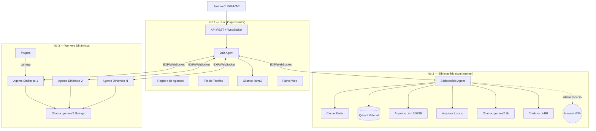
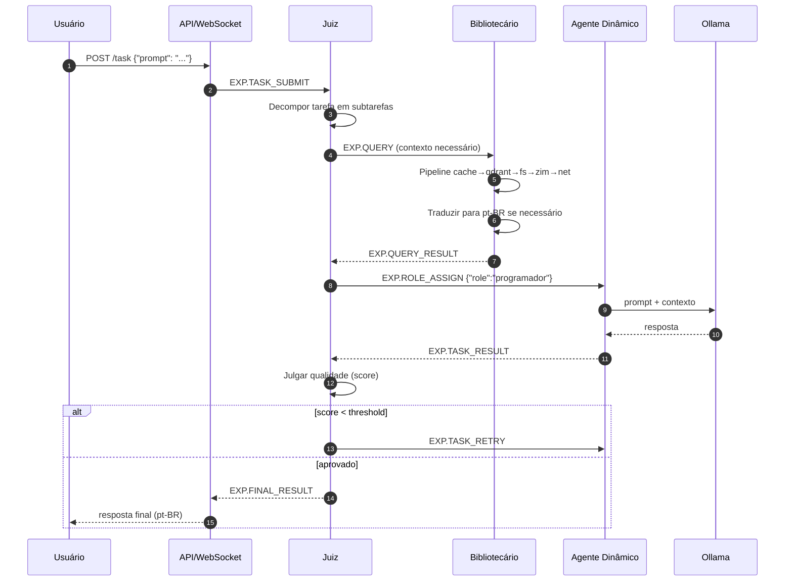
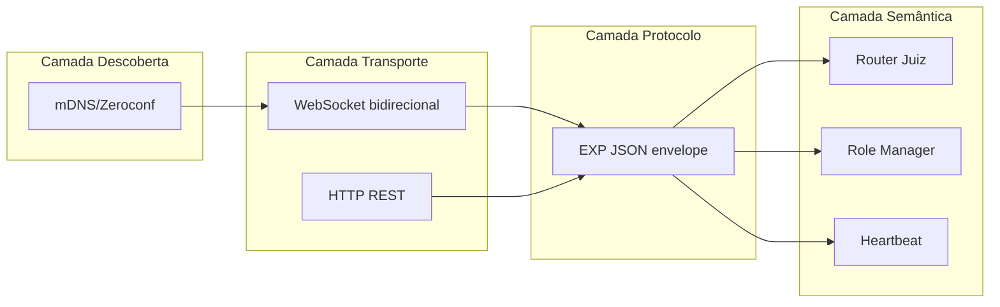
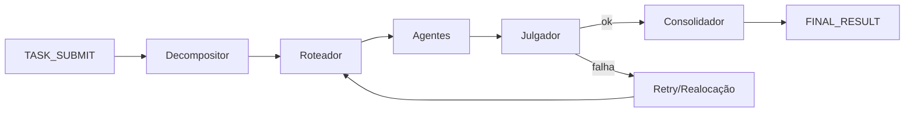
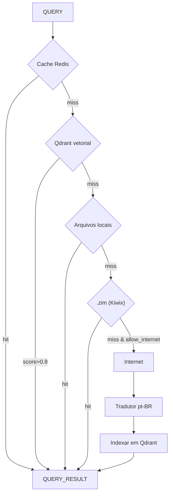
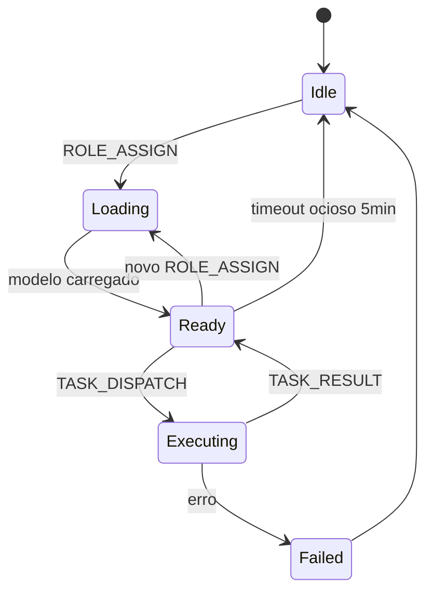
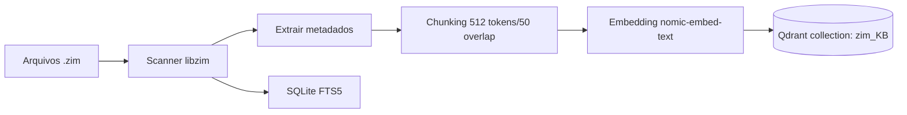
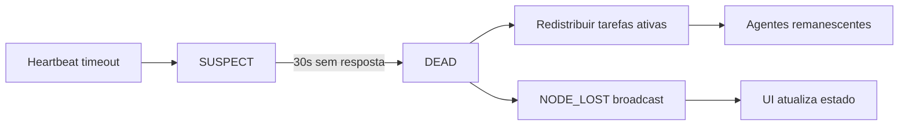
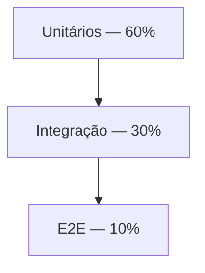

# ENXAME — Documentação Arquitetural Completa

> **Cluster Distribuído de IA Multiagente sobre Ollama**
> Versão: 1.0 • Data: 2026-07-03 • Idioma padrão: Português Brasileiro (pt-BR)
> Blueprint técnico para implementação em 3 nós Ubuntu/Xubuntu (air-gapped, exceto Bibliotecário).

---

## Sumário

1. [Visão Geral e Arquitetura Macro](#1-visão-geral-e-arquitetura-macro)
2. [Protocolo EXP (ENXAME Protocol)](#2-protocolo-exp-enxame-protocol)
3. [Estrutura de Diretórios do Projeto](#3-estrutura-de-diretórios-do-projeto)
4. [Design dos Componentes Principais](#4-design-dos-componentes-principais)
5. [Pipeline de Busca do Bibliotecário](#5-pipeline-de-busca-do-bibliotecário)
6. [Indexação de Arquivos .zim e Documentos](#6-indexação-de-arquivos-zim-e-documentos)
7. [Integração com Ollama](#7-integração-com-ollama)
8. [Banco Vetorial Qdrant](#8-banco-vetorial-qdrant)
9. [API REST e WebSocket](#9-api-rest-e-websocket)
10. [Sistema de Plugins](#10-sistema-de-plugins)
11. [Tolerância a Falhas](#11-tolerância-a-falhas)
12. [Configuração Docker Compose (3 nós)](#12-configuração-docker-compose-3-nós)
13. [Guia de Implementação Passo-a-Passo](#13-guia-de-implementação-passo-a-passo)
14. [Estratégia de Testes](#14-estratégia-de-testes)
15. [Roadmap de Expansão](#15-roadmap-de-expansão)

---

## 1. Visão Geral e Arquitetura Macro

O **ENXAME** é um cluster distribuído multiagente, air-gapped por padrão, composto por três nós Ubuntu que colaboram para resolver tarefas complexas via modelos Ollama locais. Dois agentes permanentes coordenam o sistema:

- **Juiz** — orquestrador central, roteador de tarefas, árbitro de qualidade.
- **Bibliotecário** — único nó com acesso à internet; responsável pela recuperação de conhecimento (cache → Qdrant → arquivos locais → `.zim` → internet).

Os demais **agentes dinâmicos** são workers polimórficos que assumem papéis (programador, redator, pesquisador, revisor, tradutor, matemático, etc.) sob demanda do Juiz.

### 1.1 Visão Macro do Cluster



### 1.2 Fluxo de Dados de uma Requisição



### 1.3 Comunicação Entre Componentes



**Princípios de design:**
- Isolamento por container Docker; comunicação exclusiva via EXP.
- Zero dependência de nuvem, exceto no Bibliotecário (fallback internet).
- Estado replicado no Juiz (líder) com log append-only para recuperação.
- Idempotência em todas as mensagens EXP via `msg_id` UUIDv4.

---

## 2. Protocolo EXP (ENXAME Protocol)

O **EXP** é um protocolo JSON leve sobre WebSocket (canal primário) e HTTP (canal auxiliar). Toda mensagem carrega um envelope padrão + payload tipado.

### 2.1 Envelope Padrão

```json
{
  "exp_version": "1.0",
  "msg_id": "550e8400-e29b-41d4-a716-446655440000",
  "correlation_id": "opcional-uuid-da-mensagem-original",
  "timestamp": "2026-07-03T14:20:00.000Z",
  "source": {
    "node_id": "juiz-01",
    "role": "juiz",
    "address": "192.168.1.10:7700"
  },
  "target": {
    "node_id": "bibliotecario-01",
    "role": "bibliotecario"
  },
  "type": "QUERY",
  "priority": 5,
  "ttl_ms": 30000,
  "signature": "hmac-sha256-base64",
  "payload": { }
}
```

**Campos obrigatórios:** `exp_version`, `msg_id`, `timestamp`, `source`, `type`, `payload`.
**Prioridade:** 1 (mais alta) — 10 (menor). Juiz usa 1–3 para tarefas críticas.

### 2.2 Catálogo de Tipos de Mensagem

| Tipo | Direção | Descrição |
|------|---------|-----------|
| `HELLO` | Nó → Juiz | Anúncio inicial após mDNS |
| `HELLO_ACK` | Juiz → Nó | Confirma registro, envia cluster state |
| `HEARTBEAT` | Nó → Juiz | Ping periódico (5s) |
| `ROLE_ASSIGN` | Juiz → Agente | Atribui papel dinâmico |
| `ROLE_ACK` | Agente → Juiz | Confirma troca de papel |
| `TASK_SUBMIT` | API → Juiz | Nova tarefa do usuário |
| `TASK_DISPATCH` | Juiz → Agente | Delega subtarefa |
| `TASK_RESULT` | Agente → Juiz | Resposta parcial/final |
| `TASK_RETRY` | Juiz → Agente | Refaz com feedback |
| `TASK_CANCEL` | Juiz → Agente | Cancelar |
| `QUERY` | Qualquer → Bibliotecário | Solicita informação |
| `QUERY_RESULT` | Bibliotecário → Origem | Resposta da busca |
| `JUDGE_SCORE` | Juiz → Interno | Avaliação de qualidade |
| `FINAL_RESULT` | Juiz → API | Resposta consolidada |
| `PLUGIN_LOAD` | Juiz → Agente | Carrega plugin |
| `NODE_LOST` | Juiz → Broadcast | Nó caiu, redistribuir |
| `ERROR` | Qualquer | Erro estruturado |

### 2.3 Exemplos de Payloads

**TASK_SUBMIT**
```json
{
  "type": "TASK_SUBMIT",
  "payload": {
    "task_id": "t-abc123",
    "prompt": "Escreva um resumo sobre computação quântica",
    "user_id": "user-42",
    "language": "pt-BR",
    "max_agents": 3,
    "deadline_ms": 60000,
    "requires_web": false
  }
}
```

**ROLE_ASSIGN**
```json
{
  "type": "ROLE_ASSIGN",
  "payload": {
    "role": "redator_tecnico",
    "system_prompt": "Você é um redator técnico...",
    "model": "gemma2:2b-it-qat",
    "temperature": 0.4,
    "tools": ["consultar_bibliotecario"],
    "context_docs": ["doc-id-1", "doc-id-2"]
  }
}
```

**QUERY**
```json
{
  "type": "QUERY",
  "payload": {
    "query_id": "q-xyz",
    "text": "princípios da superposição quântica",
    "top_k": 5,
    "allow_internet": false,
    "translate_to": "pt-BR"
  }
}
```

**QUERY_RESULT**
```json
{
  "type": "QUERY_RESULT",
  "payload": {
    "query_id": "q-xyz",
    "sources": [
      {"origin": "cache", "score": 0.98, "text": "..."},
      {"origin": "qdrant", "score": 0.91, "doc": "wikipedia_pt/Superposição"},
      {"origin": "zim", "score": 0.87, "file": "wikipedia_pt.zim", "article": "Superposição_quântica"}
    ],
    "used_internet": false,
    "translated": false,
    "latency_ms": 142
  }
}
```

**ERROR**
```json
{
  "type": "ERROR",
  "payload": {
    "code": "OLLAMA_TIMEOUT",
    "message": "Modelo gemma2:9b não respondeu em 30s",
    "retriable": true,
    "context": {"model": "gemma2:9b", "node": "bibliotecario-01"}
  }
}
```

### 2.4 Endpoints WebSocket & REST

**WebSocket (Juiz):**
- `ws://<juiz>:7700/exp` — canal EXP principal (agentes)
- `ws://<juiz>:7700/ui` — canal para painel web (stream de progresso)

**REST (Juiz):**
| Método | Rota | Função |
|--------|------|--------|
| POST | `/api/v1/task` | Submete tarefa |
| GET | `/api/v1/task/{id}` | Status |
| GET | `/api/v1/task/{id}/stream` | SSE de progresso |
| DELETE | `/api/v1/task/{id}` | Cancela |
| GET | `/api/v1/cluster` | Estado do cluster |
| GET | `/api/v1/agents` | Lista agentes/papéis |
| POST | `/api/v1/plugins` | Instala plugin |
| GET | `/api/v1/health` | Health check |

**REST (Bibliotecário):**
| Método | Rota | Função |
|--------|------|--------|
| POST | `/lib/query` | Busca via pipeline |
| POST | `/lib/reindex` | Força reindexação |
| GET | `/lib/status` | Estatísticas cache/qdrant/zim |
| POST | `/lib/translate` | Traduz texto para pt-BR |

### 2.5 Segurança do EXP
- HMAC-SHA256 com chave pré-compartilhada (`EXP_SHARED_SECRET`) no header `signature`.
- Timestamps rejeitados se `|now - ts| > 60s` (proteção contra replay).
- Nós autenticam via par de chaves ED25519 no `HELLO`.
- Todo tráfego WS/REST via TLS (certificados auto-assinados internos).

---

## 3. Estrutura de Diretórios do Projeto

```
enxame/
├── README.md
├── LICENSE
├── docker-compose.yml
├── .env.example
├── Makefile
│
├── docs/                          # Esta documentação
│   ├── arquitetura.md
│   ├── protocolo-exp.md
│   ├── plugins.md
│   └── diagrams/
│
├── core/                          # Biblioteca compartilhada
│   ├── __init__.py
│   ├── exp/                       # Implementação do protocolo EXP
│   │   ├── envelope.py
│   │   ├── types.py
│   │   ├── signer.py
│   │   ├── client.py              # Cliente WebSocket EXP
│   │   └── server.py              # Servidor WebSocket EXP
│   ├── discovery/                 # mDNS/Zeroconf
│   │   ├── advertiser.py
│   │   └── browser.py
│   ├── ollama/                    # Wrapper Ollama
│   │   ├── client.py
│   │   ├── pool.py                # Round-robin entre nós
│   │   └── prompts.py
│   ├── storage/                   # Persistência de estado
│   │   ├── task_log.py
│   │   └── kv.py
│   ├── logging_conf.py
│   └── utils.py
│
├── juiz/                          # Serviço Juiz
│   ├── Dockerfile
│   ├── app.py                     # FastAPI + WebSocket
│   ├── orchestrator.py            # Decomposição de tarefas
│   ├── router.py                  # Escolha de agente
│   ├── judge.py                   # Avaliação de qualidade
│   ├── registry.py                # Registro de agentes
│   ├── failover.py                # Redistribuição
│   ├── web/                       # Painel Web (React build)
│   └── requirements.txt
│
├── bibliotecario/                 # Serviço Bibliotecário
│   ├── Dockerfile
│   ├── app.py
│   ├── pipeline/                  # Pipeline de busca
│   │   ├── cache.py
│   │   ├── vector.py
│   │   ├── files.py
│   │   ├── zim.py
│   │   └── internet.py
│   ├── translator.py              # Tradução pt-BR
│   ├── indexer/
│   │   ├── zim_indexer.py
│   │   ├── file_indexer.py
│   │   └── scheduler.py
│   └── requirements.txt
│
├── agente/                        # Worker dinâmico
│   ├── Dockerfile
│   ├── app.py
│   ├── role_manager.py            # Troca de papel
│   ├── executor.py                # Executa prompt
│   ├── tools/                     # Ferramentas invocáveis
│   │   ├── consultar_bibliotecario.py
│   │   ├── executar_python.py
│   │   └── calcular.py
│   └── requirements.txt
│
├── plugins/                       # Plugins de agentes (hot-load)
│   ├── programador_python/
│   │   ├── manifest.yaml
│   │   ├── system_prompt.md
│   │   └── tools.py
│   ├── redator_tecnico/
│   └── matematico/
│
├── cli/                           # CLI do usuário
│   ├── enxame.py                  # Entry point (Typer)
│   └── requirements.txt
│
├── data/                          # Volume persistente
│   ├── zim/                       # 300GB de .zim
│   ├── files/                     # Documentos locais
│   ├── qdrant/                    # Base vetorial
│   ├── cache/                     # Redis dump
│   └── logs/
│
├── config/
│   ├── juiz.yaml
│   ├── bibliotecario.yaml
│   ├── agente.yaml
│   └── roles/                     # Templates de papéis
│       ├── programador.yaml
│       ├── redator.yaml
│       └── pesquisador.yaml
│
├── scripts/
│   ├── bootstrap.sh               # Setup inicial
│   ├── indexar_zim.sh
│   ├── health_check.sh
│   └── backup.sh
│
└── tests/
    ├── unit/
    ├── integration/
    └── e2e/
```

### 3.1 Explicação dos Módulos

- **`core/`** — código Python compartilhado entre todos os serviços. Sem dependências de framework HTTP; utilizável em CLI e workers.
- **`core/exp/`** — implementação canônica do protocolo. `envelope.py` valida schema (Pydantic), `signer.py` calcula HMAC, `client`/`server` provêem WebSocket assíncrono (baseado em `websockets`).
- **`core/discovery/`** — anúncio e descoberta via Zeroconf (`_enxame._tcp.local.`).
- **`core/ollama/pool.py`** — abstração que roteia chamadas para qualquer nó com Ollama disponível, com fallback.
- **`juiz/`** — serviço FastAPI expondo REST + WS. `orchestrator.py` faz decomposição via LLM (llama3). `judge.py` avalia respostas (rubric-based + LLM-as-judge).
- **`bibliotecario/`** — serviço com pipeline de 5 estágios, tradutor e indexadores agendados.
- **`agente/`** — imagem única replicada N vezes; assume papel via `ROLE_ASSIGN`.
- **`plugins/`** — cada subdiretório é um pacote self-contained com `manifest.yaml`, prompts e ferramentas Python.
- **`cli/`** — cliente de linha de comando (Typer + Rich).
- **`data/`** — volume Docker; **NUNCA** commitado.
- **`config/roles/`** — YAMLs declarativos que descrevem papéis pré-definidos.

---

## 4. Design dos Componentes Principais

### 4.1 Juiz

**Responsabilidades:**
1. Receber tarefas do usuário (API/CLI/Web).
2. Decompor em subtarefas via LLM planner (llama3).
3. Rotear subtarefas para agentes dinâmicos.
4. Avaliar resultados (LLM-as-judge + heurísticas).
5. Consolidar resposta final em pt-BR.
6. Monitorar saúde do cluster e redistribuir em falhas.



**Decisão de roteamento:**
- Score por agente = f(especialidade atual, carga, latência histórica, RAM disponível).
- Prefere reutilizar papel já carregado (evitar swap de modelo).

**Julgamento:** para cada resposta calcula-se um score 0–1:
- Cobertura da pergunta (embedding cosine query↔answer)
- Consistência factual (llama3 avalia contra QUERY_RESULT sources)
- Idioma correto (detect + traduzir se necessário)
- Score < 0.7 ⇒ TASK_RETRY (até 2×).

### 4.2 Bibliotecário

**Único nó com WiFi/internet.** Papel: knowledge retrieval + tradução.



Detalhes na §5.

### 4.3 Agentes Dinâmicos

Container idêntico, comportamento definido por `ROLE_ASSIGN`:



Cada agente mantém:
- `current_role` (str)
- `system_prompt` (str)
- `model` (str) — normalmente `gemma2:2b-it-qat` para respostas rápidas
- `tools` — lista de callables registrados
- Contexto de conversação (últimas N mensagens)

### 4.4 Descoberta Automática

Baseada em **Zeroconf/mDNS**:
1. Cada nó ao subir publica serviço `_enxame._tcp.local.` com TXT records: `role`, `node_id`, `capabilities`, `models`.
2. Juiz escuta broadcasts e envia `HELLO_ACK` para novos nós.
3. Se o Juiz não estiver visível em 10s, o nó entra em modo standby e retenta.

**Eleição de Juiz (opcional multi-master futuro):** algoritmo Bully sobre `node_id` lexicográfico.

---

## 5. Pipeline de Busca do Bibliotecário

Ordem estrita, cada estágio pode responder e curto-circuitar o pipeline:

### 5.1 Estágio 1 — Cache Redis
- Chave: `sha256(normalize(query) + lang)`.
- TTL padrão: 24h para conteúdo estático; 1h para "notícias".
- Retorno se `score_semantico(cached, query) > 0.95`.

### 5.2 Estágio 2 — Qdrant (Vetorial)
- Coleção `enxame_docs`, embeddings via `nomic-embed-text` (Ollama).
- Busca top-K=8, filtro por idioma preferido pt-BR.
- Aceita se best score ≥ 0.80.

### 5.3 Estágio 3 — Arquivos Locais
- Índice invertido (SQLite FTS5) sobre `/data/files/`.
- Suporta: `.md`, `.txt`, `.pdf`, `.docx`, `.html`, `.epub`.
- BM25 top-5.

### 5.4 Estágio 4 — Arquivos .zim (Kiwix)
- `libzim` Python; busca full-text no índice XAPIAN embutido.
- Se score < threshold, avança.
- Conteúdo extraído em HTML → limpo com `trafilatura`.

### 5.5 Estágio 5 — Internet (último recurso)
- Somente se `allow_internet=True` e todos estágios anteriores falharem.
- Utiliza SearXNG local ou DuckDuckGo HTML.
- Scrape com `trafilatura` + limite de 3 páginas.
- Rate-limit: 30 req/min.

### 5.6 Tradução pt-BR
Após qualquer estágio, se o resultado não estiver em pt-BR:
- Detecção via `fasttext-lid`.
- Tradução via LLM local (`gemma2:9b` com prompt de tradução) — **não** usa serviços externos.
- Textos traduzidos são armazenados no Qdrant com tag `translated=true`.

### 5.7 Feedback Loop
- Todo resultado externo (zim/internet) é **automaticamente indexado no Qdrant**, tornando futuras consultas mais rápidas.
- Cache Redis é populado no fim.

---

## 6. Indexação de Arquivos .zim e Documentos

### 6.1 Zim Indexer



- Executado uma vez no bootstrap; incremental depois.
- Progresso persistido em `data/indexer/progress.json`.
- **300 GB** ⇒ tempo estimado de indexação inicial: 12–24h em i7 + SSD; roda em background com prioridade baixa (`nice 19`).
- Chunks armazenam: `{text, zim_file, article_title, url, lang, embedding}`.

### 6.2 File Indexer
- Watcher `inotify` em `/data/files/`.
- Extractors por MIME:
  - PDF → `pdfminer.six`
  - DOCX → `python-docx`
  - HTML → `trafilatura`
  - EPUB → `ebooklib`
- Mesmo pipeline de chunking/embedding.

### 6.3 Reindexação Sob Demanda
`POST /lib/reindex {"scope":"zim"|"files"|"all"}` dispara job em background com feedback via WS.

---

## 7. Integração com Ollama

### 7.1 Alocação de Modelos por Nó

| Nó | Modelo Primário | Uso |
|----|-----------------|-----|
| Juiz | `llama3:8b` | Planejamento, julgamento, consolidação |
| Bibliotecário | `gemma2:9b` | Tradução, sumarização de fontes |
| Agentes | `gemma2:2b-it-qat` | Execução rápida de subtarefas |

### 7.2 Pool de Modelos
`core/ollama/pool.py` mantém tabela `{model → [nodes]}` e roteia:
```python
def call(model, prompt, **kw):
    for node in pool[model]:  # ordenados por latência
        try:
            return http_post(f"{node}/api/generate", ...)
        except OllamaError:
            mark_unhealthy(node); continue
    raise NoHealthyNode(model)
```

### 7.3 Prompts Padrão
- **Sistema Juiz-Planner:** decomposição em JSON estruturado.
- **Sistema Juiz-Judge:** rubric-based scoring.
- **Sistema Tradutor:** "Traduza fielmente para português brasileiro, mantendo termos técnicos consagrados. Retorne SOMENTE a tradução."

### 7.4 Parâmetros Recomendados
```yaml
llama3:
  temperature: 0.2   # planner determinístico
  num_ctx: 8192
gemma2_9b:
  temperature: 0.3
  num_ctx: 4096
gemma2_2b:
  temperature: 0.5
  num_ctx: 2048
```

---

## 8. Banco Vetorial Qdrant

### 8.1 Coleções

| Coleção | Vetor dim | Descrição |
|---------|-----------|-----------|
| `zim_kb` | 768 | Chunks de .zim |
| `files_kb` | 768 | Chunks de arquivos locais |
| `web_cache` | 768 | Resultados de internet indexados |
| `task_memory` | 768 | Histórico de tarefas (RAG conversacional) |

- Embedding: **`nomic-embed-text`** via Ollama (768d).
- Distância: **Cosine**.
- Shards: 2; replication: 1 (cluster de 1 Qdrant no Bibliotecário; futura replicação em multi-nó).

### 8.2 Payload Padrão
```json
{
  "text": "...",
  "source": "zim|file|web|task",
  "origin_id": "wikipedia_pt/Artigo",
  "lang": "pt|en|es|...",
  "translated": false,
  "chunk_index": 3,
  "created_at": "2026-07-03T14:00:00Z"
}
```

### 8.3 Consulta
```python
qdrant.search(
  collection_name="zim_kb",
  query_vector=embed(query),
  limit=8,
  query_filter=Filter(must=[FieldCondition(key="lang", match=MatchValue(value="pt"))])
)
```

---

## 9. API REST e WebSocket

### 9.1 OpenAPI Resumido

```yaml
openapi: 3.0.3
info: { title: ENXAME API, version: "1.0" }
paths:
  /api/v1/task:
    post:
      summary: Submete tarefa
      requestBody:
        content:
          application/json:
            schema:
              type: object
              required: [prompt]
              properties:
                prompt: {type: string}
                language: {type: string, default: pt-BR}
                allow_internet: {type: boolean, default: false}
                max_agents: {type: integer, default: 3}
      responses:
        "202":
          description: Aceito
          content:
            application/json:
              schema:
                type: object
                properties:
                  task_id: {type: string}
                  stream_url: {type: string}
  /api/v1/task/{id}:
    get: { summary: Status }
    delete: { summary: Cancelar }
  /api/v1/cluster: { get: { summary: Estado } }
  /api/v1/agents:  { get: { summary: Lista } }
  /api/v1/plugins: { post: { summary: Instala } }
  /api/v1/health:  { get: { summary: Healthcheck } }
```

### 9.2 WebSocket de Progresso (UI)

Cliente conecta em `ws://juiz:7700/ui?task_id=t-abc`. Recebe eventos:
```json
{"event":"decomposed","subtasks":3}
{"event":"agent_start","agent":"ag-01","role":"pesquisador"}
{"event":"query","stage":"qdrant","hits":5}
{"event":"partial","content":"..."}
{"event":"judge","score":0.86}
{"event":"final","content":"..."}
```

### 9.3 SSE Alternativo
`GET /api/v1/task/{id}/stream` (para clientes sem WS).

---

## 10. Sistema de Plugins

### 10.1 Estrutura de um Plugin

```
plugins/programador_python/
├── manifest.yaml
├── system_prompt.md
├── tools.py
└── tests/
```

**`manifest.yaml`:**
```yaml
name: programador_python
version: 1.2.0
description: Especialista em Python 3.11+
model: gemma2:2b-it-qat
temperature: 0.2
context_window: 4096
tools:
  - executar_python
  - consultar_bibliotecario
requires:
  - python: ">=3.11"
tags: [código, python, backend]
```

### 10.2 Ciclo de Vida
1. `POST /api/v1/plugins` com tar.gz do diretório.
2. Juiz valida manifest, executa sandbox de testes (`pytest`).
3. Publica no cluster via `PLUGIN_LOAD` broadcast.
4. Agentes ociosos baixam e ficam disponíveis para receber esse papel.
5. Hot-reload sem reiniciar containers.

### 10.3 Segurança
- Ferramentas rodam em subprocess com `seccomp` + limite de CPU/RAM.
- `executar_python` usa `RestrictedPython` + timeout.

---

## 11. Tolerância a Falhas

### 11.1 Detecção
- Heartbeat EXP a cada 5s; timeout 15s ⇒ nó marcado `SUSPECT`, 30s ⇒ `DEAD`.
- Falha em `Ollama` health check ⇒ modelo removido do pool.

### 11.2 Reação



- Tarefas em andamento no nó morto são **reenfileiradas** com `attempt_count++` (máx 3).
- Estado do Juiz é persistido em `data/state/juiz.jsonl` (append-only) — permite recuperação em restart.
- **Bibliotecário fora do ar:** consultas continuam com Qdrant/cache local se replicados; agentes recebem `QUERY_RESULT` com `degraded=true`.
- **Juiz fora do ar:** cluster fica em modo `read-only`; agentes mantêm último `ROLE_ASSIGN`. Docker `restart: always` reinicia; ao voltar, replay do log.

### 11.3 Circuit Breaker
Cada chamada a Ollama/Qdrant/HTTP externo passa por circuit breaker (`pybreaker`): 5 falhas em 60s abre por 30s.

### 11.4 Backpressure
Fila do Juiz tem tamanho máx 100; excedentes retornam HTTP 429 com `Retry-After`.

---

## 12. Configuração Docker Compose (3 nós)

Cada nó tem seu próprio `docker-compose.yml` referenciando imagens comuns. Rede overlay via **Docker Swarm mode** OU bridge simples com IPs fixos.

### 12.1 Nó 1 — Juiz (`node1-juiz/docker-compose.yml`)

```yaml
version: "3.9"
services:
  ollama-juiz:
    image: ollama/ollama:latest
    volumes: ["ollama_juiz:/root/.ollama"]
    ports: ["11434:11434"]
    deploy: { resources: { reservations: { devices: [{driver: nvidia, count: all, capabilities: [gpu]}] } } }
    restart: always

  juiz:
    build: ../juiz
    environment:
      - NODE_ID=juiz-01
      - ROLE=juiz
      - OLLAMA_URL=http://ollama-juiz:11434
      - EXP_SHARED_SECRET=${EXP_SHARED_SECRET}
    ports:
      - "7700:7700"   # EXP + REST + WS
      - "8080:8080"   # Painel Web
    volumes:
      - ../data/state:/app/state
      - ../config:/app/config:ro
    depends_on: [ollama-juiz]
    restart: always

volumes:
  ollama_juiz:
```

### 12.2 Nó 2 — Bibliotecário (`node2-bib/docker-compose.yml`)

```yaml
version: "3.9"
services:
  ollama-bib:
    image: ollama/ollama:latest
    volumes: ["ollama_bib:/root/.ollama"]
    ports: ["11434:11434"]
    restart: always

  qdrant:
    image: qdrant/qdrant:v1.11.0
    volumes: ["../data/qdrant:/qdrant/storage"]
    ports: ["6333:6333", "6334:6334"]
    restart: always

  redis:
    image: redis:7-alpine
    volumes: ["../data/cache:/data"]
    command: redis-server --save 60 1 --appendonly yes
    restart: always

  bibliotecario:
    build: ../bibliotecario
    environment:
      - NODE_ID=bib-01
      - ROLE=bibliotecario
      - JUIZ_URL=ws://192.168.1.10:7700/exp
      - OLLAMA_URL=http://ollama-bib:11434
      - QDRANT_URL=http://qdrant:6333
      - REDIS_URL=redis://redis:6379
      - ZIM_PATH=/data/zim
      - FILES_PATH=/data/files
      - ALLOW_INTERNET=true
      - EXP_SHARED_SECRET=${EXP_SHARED_SECRET}
    volumes:
      - ../data/zim:/data/zim:ro
      - ../data/files:/data/files
      - ../data/indexer:/data/indexer
    ports: ["7710:7710"]
    depends_on: [ollama-bib, qdrant, redis]
    restart: always

volumes:
  ollama_bib:
```

### 12.3 Nó 3 — Workers (`node3-workers/docker-compose.yml`)

```yaml
version: "3.9"
services:
  ollama-worker:
    image: ollama/ollama:latest
    volumes: ["ollama_worker:/root/.ollama"]
    ports: ["11434:11434"]
    restart: always

  agente-1: &agente
    build: ../agente
    environment:
      - NODE_ID=ag-01
      - ROLE=dynamic
      - JUIZ_URL=ws://192.168.1.10:7700/exp
      - OLLAMA_URL=http://ollama-worker:11434
      - EXP_SHARED_SECRET=${EXP_SHARED_SECRET}
    volumes:
      - ../plugins:/app/plugins:ro
    depends_on: [ollama-worker]
    restart: always

  agente-2:
    <<: *agente
    environment:
      - NODE_ID=ag-02
      - ROLE=dynamic
      - JUIZ_URL=ws://192.168.1.10:7700/exp
      - OLLAMA_URL=http://ollama-worker:11434
      - EXP_SHARED_SECRET=${EXP_SHARED_SECRET}

  agente-3:
    <<: *agente
    environment:
      - NODE_ID=ag-03
      - ROLE=dynamic
      - JUIZ_URL=ws://192.168.1.10:7700/exp
      - OLLAMA_URL=http://ollama-worker:11434
      - EXP_SHARED_SECRET=${EXP_SHARED_SECRET}

volumes:
  ollama_worker:
```

### 12.4 `.env` Comum
```
EXP_SHARED_SECRET=troque-esta-chave-forte
CLUSTER_NAME=enxame-prod
TZ=America/Sao_Paulo
```

### 12.5 Pull de Modelos (script)
```bash
# Em cada nó, após subir Ollama:
docker exec -it ollama-juiz ollama pull llama3
docker exec -it ollama-bib  ollama pull gemma2:9b
docker exec -it ollama-bib  ollama pull nomic-embed-text
docker exec -it ollama-worker ollama pull gemma2:2b-it-qat
```

---

## 13. Guia de Implementação Passo-a-Passo

### Fase 0 — Preparação (Dia 1)
1. Instalar Ubuntu Server 22.04 nas 3 máquinas; IPs estáticos `192.168.1.10/11/12`.
2. Instalar Docker + Docker Compose + `avahi-daemon`.
3. Conectar apenas o nó 2 (Bibliotecário) ao WiFi com internet.
4. Clonar repositório em `/opt/enxame` nos três nós.

### Fase 1 — Core & EXP (Dias 2–4)
1. Implementar `core/exp/envelope.py` com Pydantic schemas.
2. HMAC signer + validação de replay.
3. WebSocket client/server assíncrono; testes unitários.
4. Descoberta mDNS.

### Fase 2 — Juiz Mínimo (Dias 5–7)
1. FastAPI com `/api/v1/task` e `/exp` WS.
2. Registry de agentes; heartbeat.
3. Orquestrador simples (1 tarefa → 1 agente, sem decomposição ainda).
4. Persistência de estado em JSONL.

### Fase 3 — Agente Dinâmico (Dias 8–9)
1. Loop de conexão ao Juiz.
2. `ROLE_ASSIGN` altera prompt + modelo.
3. Executor chamando Ollama.
4. Ferramenta `consultar_bibliotecario` stub.

### Fase 4 — Bibliotecário (Dias 10–14)
1. FastAPI + WS ao Juiz.
2. Redis cache.
3. Integração Qdrant + embeddings.
4. Indexador de `.zim` (libzim).
5. Indexador de arquivos.
6. Tradutor com `gemma2:9b`.
7. Fallback internet (SearXNG).

### Fase 5 — Julgamento & Decomposição (Dias 15–17)
1. Prompt do planner em `llama3`.
2. Judge rubric-based.
3. Retry com feedback.

### Fase 6 — Painel Web + CLI (Dias 18–20)
1. React SPA com WS stream.
2. CLI Typer com `enxame ask "..."`.

### Fase 7 — Plugins & Failover (Dias 21–23)
1. Loader de plugins.
2. Failover automático + backup de estado.

### Fase 8 — Endurecimento (Dias 24–28)
1. TLS interno.
2. Backups automatizados (`scripts/backup.sh` via cron).
3. Observabilidade: Prometheus + Grafana opcional.

### Fase 9 — Testes & Go-Live (Dias 29–30)
1. Suite E2E completa.
2. Simulação de queda de nó.
3. Deploy em produção.

---

## 14. Estratégia de Testes

### 14.1 Pirâmide



### 14.2 Unitários (`tests/unit/`)
- `test_envelope.py` — validação/assinatura EXP.
- `test_signer.py` — HMAC + replay.
- `test_router.py` — escolha de agente por carga.
- `test_pipeline_cache.py`, `test_pipeline_zim.py`, etc.
- **Alvo:** 85% de cobertura em `core/` e `bibliotecario/pipeline/`.

### 14.3 Integração (`tests/integration/`)
- Docker Compose de teste com mocks de Ollama (`ollama-mock` que retorna fixtures).
- Testes ponta-a-ponta do pipeline do Bibliotecário com um `.zim` sample de 50MB.
- Descoberta mDNS entre 2 containers.

### 14.4 E2E (`tests/e2e/`)
- Sobe cluster completo em Docker.
- Cenários:
  - Tarefa simples resolvida sem internet.
  - Tarefa que exige `.zim` + tradução.
  - Falha simulada do nó 3 (worker) durante execução.
  - Falha do Bibliotecário: sistema degrada graciosamente.
  - Instalação de plugin em runtime.

### 14.5 Carga & Estresse
- `locust` disparando 100 tarefas concorrentes.
- Métricas: p50/p95/p99 latência, taxa de retry, uso de RAM/GPU.

### 14.6 Chaos Engineering (opcional)
- `pumba` derrubando containers aleatoriamente por 5min.
- Assert: nenhuma tarefa perdida, taxa de sucesso ≥ 95%.

### 14.7 CI/CD
- GitHub Actions (ou Gitea local air-gapped) rodando unitários em cada push.
- Integração/E2E em nightly.

---

## 15. Roadmap de Expansão

### v1.1 (2 meses)
- Multi-Juiz com eleição Raft.
- Cache distribuído (Redis Cluster).
- Autenticação de usuários (JWT) na API.

### v1.2 (4 meses)
- Suporte a modelos maiores (llama3.1:70b) via nó GPU dedicado.
- Fine-tuning local (LoRA) sobre base de tarefas históricas.
- Voice interface (Whisper + Piper para TTS pt-BR).

### v1.3 (6 meses)
- Federação entre clusters ENXAME (protocolo EXP inter-cluster).
- Marketplace de plugins.
- Painel de custo/energia por tarefa.

### v2.0 (12 meses)
- Aprendizado contínuo: Juiz ajusta prompts de papéis com base em feedback do usuário.
- Suporte multimodal (imagens via LLaVA local).
- Rota mobile (app React Native que fala com o cluster via VPN).

### v2.x — Ideias exploratórias
- Substituir Ollama por vLLM em nós com GPU forte.
- Migração de Qdrant para Weaviate quando > 100M vetores.
- Agentes autônomos com goals persistentes (AutoGPT-like) governados pelo Juiz.

---

## Apêndice A — Glossário
- **EXP:** ENXAME Protocol.
- **Juiz:** agente orquestrador central.
- **Bibliotecário:** agente com acesso a internet + conhecimento.
- **.zim:** formato de arquivo Kiwix contendo snapshots offline de sites (Wikipedia, Stack Exchange, etc.).
- **Papel (Role):** persona/especialidade que um agente dinâmico assume.
- **Air-gapped:** desconectado da internet.

## Apêndice B — Referências
- Kiwix / libzim: <https://kiwix.org>
- Ollama: <https://ollama.com>
- Qdrant: <https://qdrant.tech>
- Zeroconf: RFC 6762
- FastAPI, WebSockets, Pydantic v2

---

**Fim do documento — versão 1.0**
