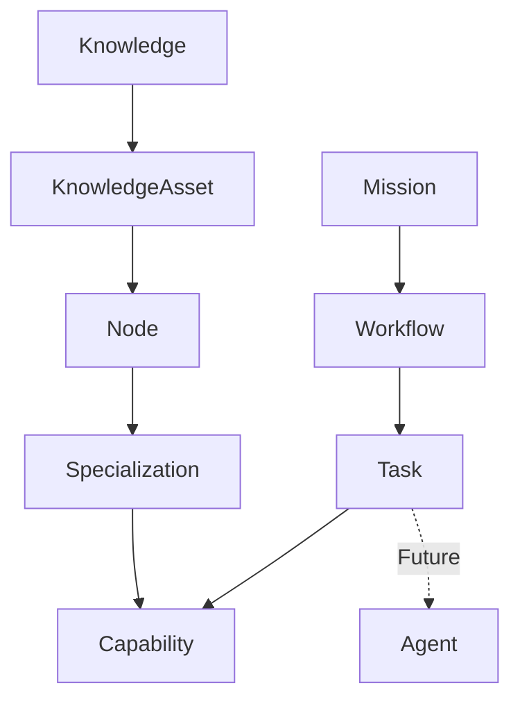

# Concepts

This directory contains conceptual specifications for the Enxame Domain Model.

## Concepts

| File | Concept |
|------|---------|
| `knowledge.md` | Knowledge |
| `knowledge_asset.md` | Knowledge Asset |
| `node.md` | Node |
| `specialization.md` | Specialization |
| `mission.md` | Mission |
| `mission_lifecycle.md` | Mission Lifecycle |
| `workflow.md` | Workflow |
| `workflow_lifecycle.md` | Workflow Lifecycle |
| `task_lifecycle.md` | Task Lifecycle |
| `event_catalog.md` | Event Catalog |

## Principles

- Each concept is independent and self-contained
- Relationships between concepts are explicit
- Concepts do not contain implementation details
- Concepts may evolve through EIPs

## Dependency Diagram

