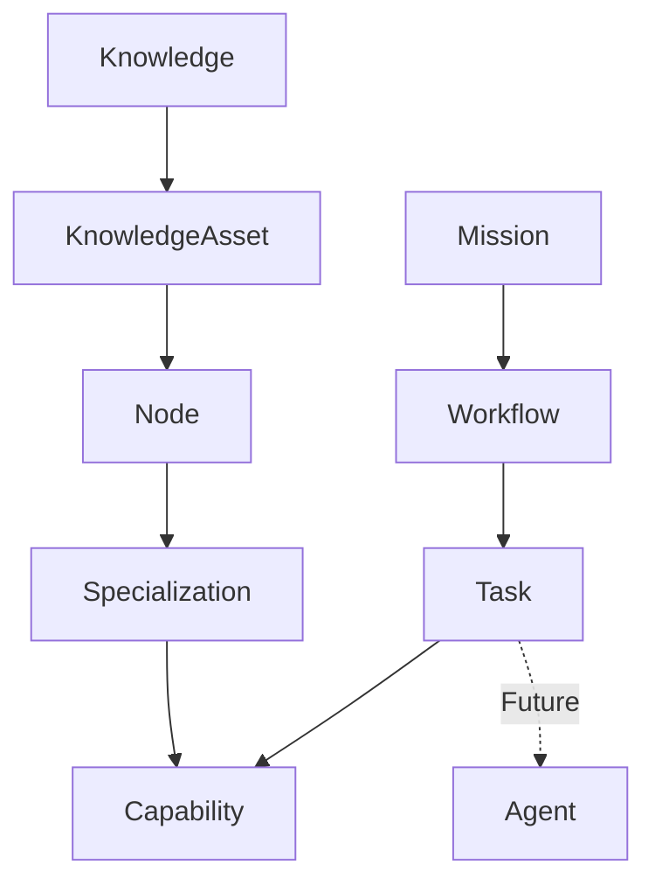

# Conceitos

Este diretório contém especificações conceituais para o Modelo de Domínio Enxame.

## Conceitos

| Arquivo | Conceito |
|---------|----------|
| `knowledge.md` | Conhecimento |
| `knowledge_asset.md` | Ativo de Conhecimento |
| `node.md` | Node |
| `specialization.md` | Especialização |
| `mission.md` | Missão |
| `workflow.md` | Workflow |

## Princípios

- Cada conceito é independente e auto-contido
- Relacionamentos entre conceitos são explícitos
- Conceitos não contêm detalhes de implementação
- Conceitos podem evoluir através de EIPs

## Diagrama de Dependência

